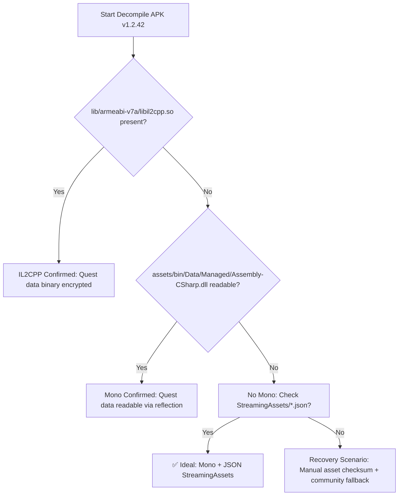

# APK Extraction Pre-Flight Forensics

> Mandatory pre-flight check per REVIEW_REPORT C5. This document guides the 4-6 hour "Phase 0" work to verify extraction viability. If IL2CPP is confirmed without JSON data, MVP must pivot to community Fandom scrape fallback with +1-2 week timeline adjustment.

## Goal
Determine:
1. Game engine backend: IL2CPP vs Mono (quest data readable?)
2. Data storage strategy: Unity JSON StreamingAssets vs binary asset bundles
3. Fallback tiers viable if primary extraction fails

## Tools Required
- [jadx](https://github.com/skylot/jadx) (0.8+)
- Java (JDK 11+)
- [il2cppdumper](https://github.com/Perfare/Il2cppDumper/releases) (IL2CPP only)
- [dnSpy](https://github.com/dnSpyEx/dnSpy/releases) (Mono assemblies)
- ADB (for MuMuPlayer API access)

## Step 1: Download APK

```bash
mkdir -p data/raw_extracted && cd data/raw_extracted

# Option A: Pull from MuMuPlayer device
adb connect 127.0.0.1:16384  # Default MuMu port
adb shell pm path com.StudioWheel.Bard | tee apk_path.txt
adb pull $(cat apk_path.txt | cut -d":" -f2) life-in-adventure.apk

# Option B: Download from APKMirror
curl -J -L -o life-in-adventure.apk \
"https://www.apkmirror.com/apk/studiowheel/life-in-adventure/life-in-adventure-1-2-42-release/life-in-adventure-1-2-42-android-apk-download/"
```

## Step 2: Decompile APK

```bash
# Decompile with jadx
jadx --output-dir decoded --show-bad-code --log-level INFO life-in-adventure.apk

# Check engine indicator
cd decoded
```

## Step 3: Detection Flowchart



## Step 4: Engine Backend Tests

```bash
# Test Paths
IL2CPP_PRESENT=$(/bin/ls -1 decoded/lib/armeabi-v7a/libil2cpp.so 2>/dev/null | wc -l)
MONO_DLL=($(/bin/ls -1 decoded/assets/bin/Data/Managed/Assembly-CSharp.dll 2>/dev/null))
JSON_ASSETS=($(/bin/ls -1 decoded/assets/StreamingAssets/*.json 2>/dev/null))
UNITY_ASSETBUNDLES=($(/bin/ls -1 decoded/assets/bin/Data/* 2>/dev/null | grep -v "globalgamemanagers"))

if [ "$IL2CPP_PLRESENT" -eq 1 ]; then
  echo "❌ IL2CPP CONFIRMED: Quest event/choice logic likely stored as binary/encrypted."
  echo "Fallback Tier: community scrape Fandom wiki discussions."
  echo "PIVOT REQUIRED: See IL2CPP Decision Tree below."
elif [ -f "${MONO_DLL[0]}" ]; then
  echo "✅ Mono backend: Assembly-CSharp.dll should contain quest logic."
  echo "Extract via dnSpy or Mono Cecil reflection:"
  echo "  dotnet add package Mono.Cecil"
  echo "  cecil-dump MSILED Assembly-CSharp.dll > quest_data_parsed.json"
elif [ -n "${JSON_ASSETS[0]}" ]; then
  echo "✅ Mono + JSON StreamingAssets: game serializes quests as JSON."
  echo "Parse direction to structured schema."
  echo "Sample names: quests_en.json, events_side.json"  
else
  echo "⚠️ No Mono DLL or JSON found. Recovery route:"
  echo "  - Check Unity asset bundles via UAssetGUI/Unity Studio"
  echo "  - Fallback: Community wiki scrape"
fi
```

## Step 5: IL2CPP Decision Tree

| Scenario | Outcome | Action |
|----------|--------|--------|
| **IL2CPP + No JSON** | ❌ Extraction Gap | **PIVOT REQUIRED**: Community Fandom scrape |
| Mono + Assembly-CSharp.dll private serialized | ⚠️ Reflection Pain | Engage mono Cecil reflection or il2cppdumper (risky) |
| **Mono + Assembly-CSharp.dll public serialized** | ✅ Ideal | Direct reflection C# → JSON |
| Mono + JSON StreamingAssets | ✅ Ideal | Parse JSON → schema (fastest) |
| Unity asset bundles encrypted | ⚠️ Recovery Mode | Endorsement needed from Studio Wheel community

## Step 6: Fallback Tiers

Tier | Strategy | Estimated Dev Time |
|------|--------|-------------------|
| T1 | Mono + JSON StreamingAssets | ~2–8 hours |
| T2 | Mono + reflection dump Assembly-CSharp.dll | ~1–2 days |
| T3 | il2cppdumper reverse mono → C++ IL logic | ~3–5 days (expert only) |
| T4 | **Community scrape** Fandom/Reddit/Scribd | ~3–7 days (data cleanup) |

Tier 4 fallback is HIGH CONFIDENCE given Fandom wiki (~200 epilogues) and community Discord guides.

## Step 7: Verify Sample Quest Data

If JSON found (`assets/StreamingAssets/`):

```js
// quest_sample.json
{
  "quests": {
    "id": "q_main_001",
    "title": "The Beginning",
    "events": ["evt_guild_01", "evt_guild_02"]
  },
  "events": {
    "id": "evt_guild_01",
    "quest_id": "q_main_001",
    "choices": [{ "text": "Register", "stat_check": null }]
  }
}
```

Validate against schema: `python scripts/validate_sample.py --file quest_sample.json`

## Revisit Rand Model Check

Per `GAME_MECHANICS.md` §14 Q1+Q9:

```bash
# Damage calculation
strings decoded/lib/armeabi-v7a/lib*.so | grep -i damageformula

# HP formula
strings decoded/lib/*/lib*.so | grep -i constitutionstattohp

# GAME_GLOBALS.bin verification
hexdump -C decoded/assets/bin/Data/globalgamemanagers | head -n 20
```

## Report Template

```markdown
## APK Extraction Pre-Flight Report

- **APK Version**: 1.2.42
- **Engine Backend**: [IL2CPP | Mono]
- **Data Storage**: [JSON StreamingAssets | Mono DLL reflection | Asset Bundles binary]
- **Quest Events Found**: ? (~80–1,500 expected)
- **Choice Population Density**: ? (~400–2,000)

### Verified Features
- ✅ EXP Management Strategy
- ✅ Alignment Tier model (Good/Moral/Neutral/Impure/Evil)
- ✅ Stat thresholds (≥13, ≥20, ≥27)

### Open Questions Resolved Here (or next step)
| Q | Question (GAME_MECHANICS §14) | Answer |
|---|------------------------------|----------|
| Q1 | Damage formula STR/DEX contrib | [verified reflection | pending community]
| Q2 | CON → HP formula | [verified]
| Q8 | Alignment shift magnitude per event | [tier-based: ±1 ~ ±10 | scalar: ±1 ~ ±5]

### Decision
- ✅ Extraction TIER [1|2|3|4] VIABLE, procede to Phase 1 **OR**
- ❌ IL2CPP GAP; MVP PIVOT → Community scrape underway
```

## References
- [[08 AI Workflow/Handover Notes/Handover - LifeInAdventure-Tools - Deep Review Findings]]
- [[docs/review/REVIEW_REPORT]]
- [[docs/data/GAME_MECHANICS]] §14 Open Questions (resolve priority)
- [[04 Projects/LifeInAdventure-Tools/#next-steps]] Phase 0 Decision Tree