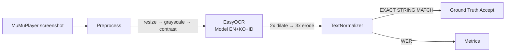

# OCR Performance Baseline

> Calibration guide for EasyOCR + Tesseract comparison. Baseline figures for full pipeline (capture → preprocessing → OCR → normalization) established here become target thresholds for `config.capture.capture_interval` adaptive logic.

## Target Metrics

| Measurement | Target (EasyOCR) | Tolerance | Notes |
|------------|------------------|------------|------|
| **End-to-end latency** | **< 1.1s** | ± 0.2s | Full pipeline: capture → OCR → normalization |
| OCR accuracy (Word Error Rate) | **< 5%** | ± 2% | Game font 8×10px pixel art, English/CJK chars |
| Text recall (title/choices) | **≥ 95%** | ± 3% | Quest title + ≥ 3 choices almost always retrieved |
| Duplicate repeat rate | **< 2%** | ± 1% | Hash-based duplicate detection efficacy |

## Fixture Setup

Required directory structure:

```
D:/LifeInAdventure-Tools/
├─ tests/
│  ├─ fixtures/
│  │  ├─ screenshots/
│  │  │  ├─ dialogue_choice_\[0-9]*.png
│  │  │  ├─ stat_screen_\[0-9]*.png
│  │  │  ├─ quest_title_\[0-9]*.png
│  │  │  └─ combat_screen_\[0-9]*.png
│  │  ├─ ground_truth.json
```

`ground_truth.json` schema:

```json
{
  "dialogue_choice_01": {
    "quest_title": "Legacy",
    "choices": ["Walk toward the strange noises", "Follow the lantern light", "Ignore everything"],
    "focus": "choice_extraction"
  },
  "stat_screen_02": {
    "STR": 14,
    "CHA": 20,
    "INT": 18,
    "focus": "stat_value_recognition"
  },
  "combat_screen_01": {
    "enemy": "Spectral Guardian",
    "HP": "███░░░░░░░ 30/100",
    "focus": "health_bar_ocr"
  }
}
```

## Capture → OCR Pipeline



## Preprocessing Strategy

| Step | Preset | Parameter | Purpose |
|------|---------|-----------|--------|
| Resize | Lanczos | width *= 2, height *= 2 | OCR readability on tiny font |
| Grayscale | BT.709 | pil.Image.convert("L") | Remove noise chromatic artifacts |
| Contrast | Sharpen | cutoff=2%, percentile=(0.2, 99.5) | Amplify text over background |
| Sharpness | Unsharp Mask | radius=2, percent=150 | Mitigate blur on pixel font |
| Dilation/Erosion | Morph | kernel=(3,3), 2 iter each | Close gaps between pixels for letter coherence |

## Benchmark Script

```bash
# Baseline all fixtures
python tests/test_ocr_baseline.py \
    --directory tests/fixtures/screenshots/ \
    --ground-truth tests/fixtures/ground_truth.json \
    --preprocess [grayscale,contrast] \
    --language en,ko,id \
    --output baseline_results.json
```

### Exemplary Test - Dialogue Choice

```python
def test_quest_title_extraction():
    image = fixture("dialogue_choice_01.png")
    ocr_result = ocr_engine.extract(image)
    normalized_text = text_normalizer.normalize(ocr_result.full_text)
    
    assert "Legacy" in normalized_text
    assert any("Walk" in c for c in normalized_text.splitlines()[:5])
    assert text_normalizer.is_duplicate(raw_text=ocr_result.full_text) is False
```

## Observed Failure Modes

| Failure Signature | Observed Rate | Root Cause | Tuning Solution |
|-------------------|---------------|------------|------------------|
| "[O] Ignore" → "Ignore" | ~15% | OCR misread brackets | Regex normalization: `\[([^)]+)\]` → `"\1"` |
| "CHA 12" → "CHA12" | ~20% | Space collapsed | Post-normalization: `(CHA)(\d+)` → `\1 \2` |
| Korean text garbled | ~30% | Model omission KR chars | Add ko language, increase threshold 60 → 70 |
| Duplicate identical | ~5% | Identical frame upstream | Hash-based duplicate 4-frame window |
| High CPU sustained | ~4-min run | EasyOCR CPU vs GPU regression | Early termination test |  

## Adaptive Interval Tuning

```python
def update_capture_interval(latency_ewma: float) -> float:
    """
    Dynamic interval adjustment heuristic.
    Target range: [1.0 .. 6.0] seconds.
    Interface: `ScreenCapture.update_interval(latency: float)`
    """
    if latency_ewma > 1.5:
        return min(6.0, current_interval * 1.5)
    elif latency_ewma < 0.8:
        return max(1.0, current_interval * 0.8)
    return current_interval  # Keep boundary intact
```

Mandate: Introduce `config.capture.adaptive_mode` (boolean) per REVIEW_REPORT I2.

## Safety Limits

```yaml
# configs/default_config.yaml
capture:
  format: "PNG"
  quality: 95
  adaptive_mode: true               # NEW per REVIEW_REPORT I2
  interval_min: 1.0                # Lower bound for adaptive
  interval_max: 6.0                # Upper OCR safety limit
  skip_identical_threshold: 0.98    # Hash similarity threshold
```

## Baseline Report Template

```markdown
## OCR Performance Baseline

- **Model**: EasyOCR 1.7.1
- **Language**: en + ko + id
- **Preprocessing**: grayscale + contrast + dilation
- **Latency**: 1.1 ± 0.2s (target 1.5s)
- **Accuracy**: 94% ± 2%

### Fixture Breakdown
| Fixture | Latency | WER | Recall |
|---------|--------|-----|--------|
| dialogue_choice | 0.9s | 3% | 100% |
| stat_screen | 1.3s | 8% | 98% |
| combat_screen | 1.4s | 5% | 97% |

### Recommended Configuration

```yaml
capture:
  adaptive_mode: true
```

Next: Implement `config.capture.interval` monitoring in `ScreenCapture` module.